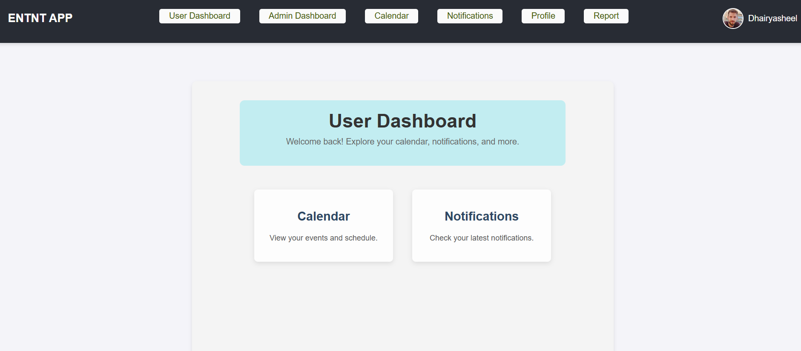
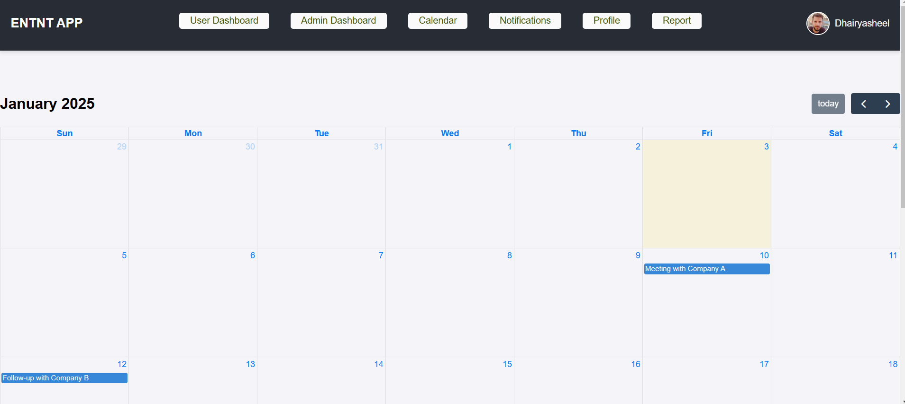
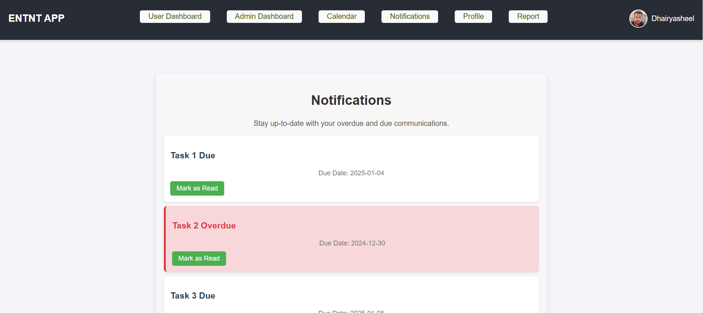
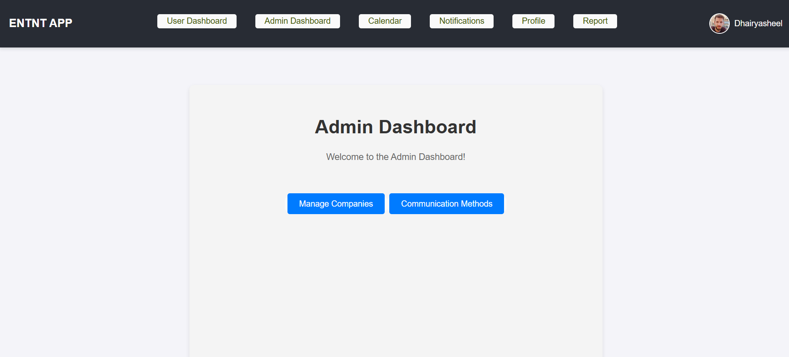
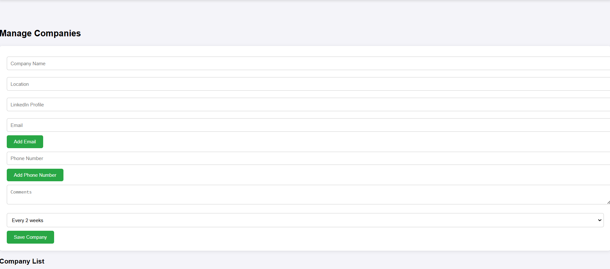
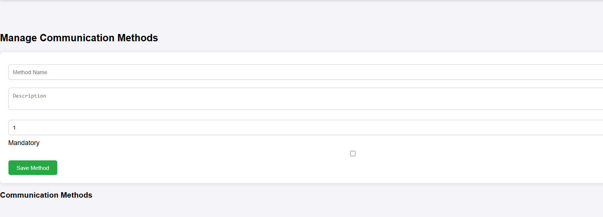
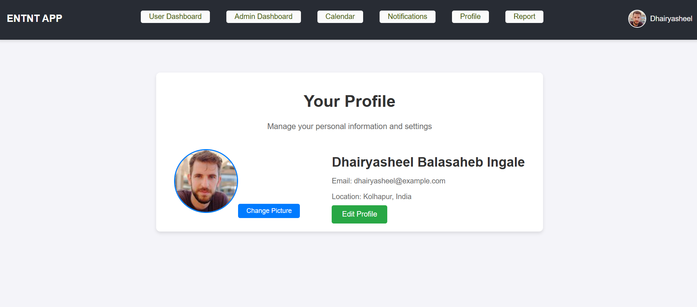
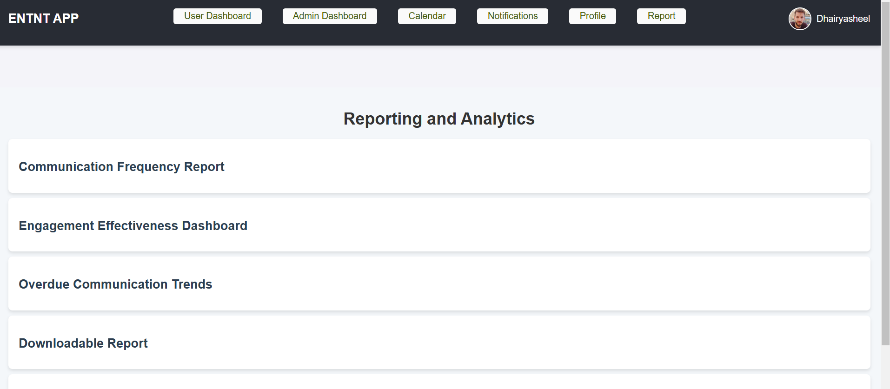

# ENTNT APP

**ENTNT APP** is a web-based application that provides a dashboard for managing communication with different companies. It offers features for tracking communication methods, engagement effectiveness, overdue communication trends, and real-time activity logs.

## Features

- **User Dashboard:** Displays a personalized view with important information and activities.
- **Admin Dashboard:** Allows administrators to manage companies, and communication methods, and view relevant analytics.
- **Calendar Integration:** View important dates, tasks, and events.
- **Notifications:** Receive real-time notifications for activities and updates.
- **Profile:** Update user profile details and preferences.
- **Reporting and Analytics Module:** Provides actionable insights and performance metrics related to company communications, including:
  - Communication Frequency Report
  - Engagement Effectiveness Dashboard
  - Overdue Communication Trends
  - Downloadable Reports (PDF/CSV)
  - Real-Time Activity Log

## Technologies Used

- **Frontend:** 
  - React.js
  - React Router
  - Chart.js (for charts and visualizations)
  - CSS (for styling)

- **Backend:** 
  - N  ress.js
  - MongoDB (for storing user data and communication logs)

- **Deployment:**
  - Deployed using [Netlify](https://www.netlify.com/) for the frontend

## Installation

Follow these steps to set up the project locally.

### Prerequisites

Ensure you have the following installed:

- **Node.js** (version 14 or higher)
- **npm** (or **yarn**)
- **MongoDB** (for the backend database)

### Clone the repository

```bash
git clone https://github.com/your-username/entnt-app.git
cd entnt-app
```
### Install dependencies
- **For the frontend:**
```bash
cd frontend
npm install
```
- **For the backend:**

```bash
cd backend
npm install
```
- **Environment Setup:**

   Create a .env file in the root of the backend folder and add the following environment variables:
```bash
MONGODB_URI=your_mongodb_connection_url
PORT=your_preferred_port
```
### Run the application
- **For the frontend:**

```bash
cd frontend
npm start
```
- **For the backend:**
```bash
cd backend
npm start
```
The frontend should now be running on http://localhost:3000, and the backend on http://localhost:5000.

### Usage
- Open http://localhost:3000 in your browser to access the ENTNT APP.
- Log in or create an account to view the User or Admin dashboard.
- Explore the various features, including managing companies, communication methods, and accessing the reporting and analytics section.
Folder Structure
PHP
```bash
ENTNT-App/
│
├── frontend/               # React frontend code
│   ├── public/             # Public assets like index.html
│   └── src/                # Source code for frontend components
│
└── backend/                # Node.js backend code
    ├── models/             # Database models (MongoDB)
    ├── routes/             # Express routes for API
    └── controllers/        # Controllers for handling API logic
```
### Contributing
We welcome contributions to improve the ENTNT APP! If you want to contribute, follow these steps:

1. Fork the repository.
2. Create a new branch (git checkout -b feature-branch).
3. Commit your changes (git commit -am 'Add new feature').
4. Push to the branch (git push origin feature-branch).
5. Create a new Pull Request.
### License
This project is licensed under the MIT License - see the LICENSE file for details.

### Acknowledgements
- React.js - A JavaScript library for building user interfaces.
- Node.js and Express.js are used to build the backend API.
- MongoDB - A NoSQL database for storing data.
- Chart.js - Used for creating visual reports and analytics charts.
- Netlify & Heroku - Used for deployment.
### Contact
For any questions or inquiries, feel free to reach out to the project maintainer at:

**Email:** dhairyasheelingale622@gmail.com

**GitHub:** https://github.com/dhairyasheel2105

## Screenshots
**1.**  
  **User Dashboard**


**2.**  
  **Calendar**


**3.**  
  **Notifications**


**4.**  
  **Admin Dashboard**


**5.**  
  **Manage Companies**


**6.**  
  **Communication Methods**


**7.**  
  **Profile**


**8.**  
  **Reports**

